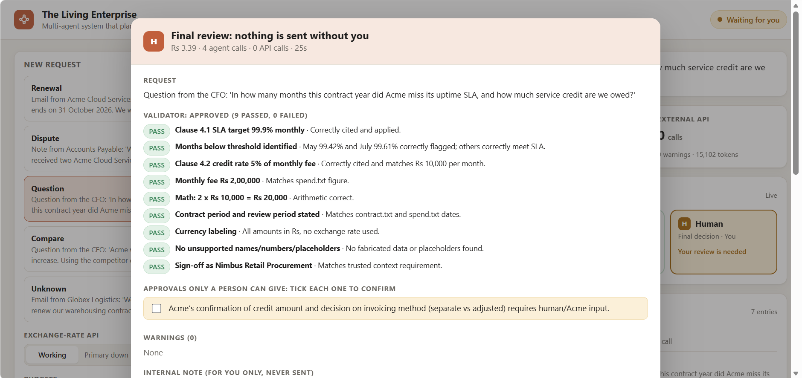
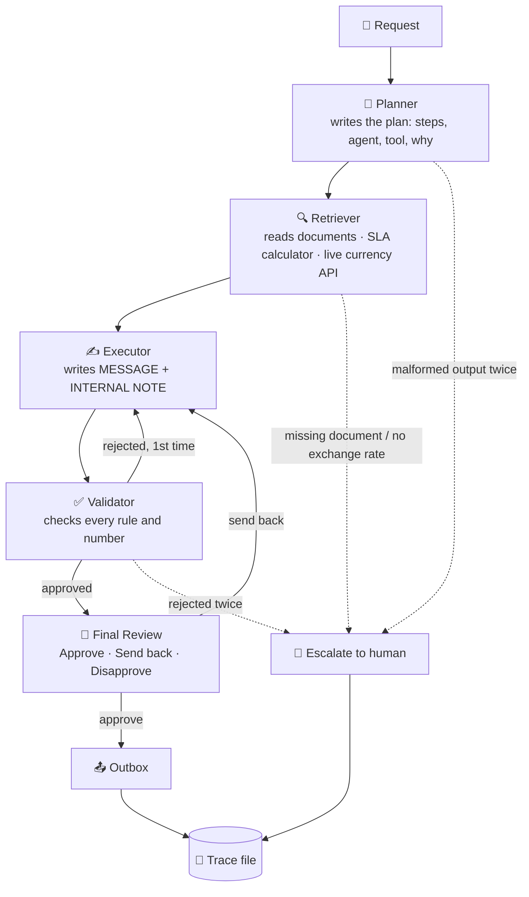
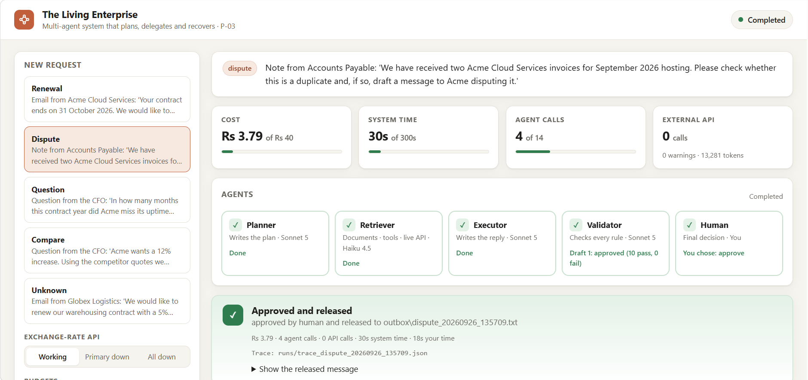
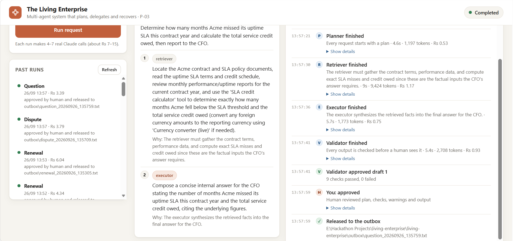
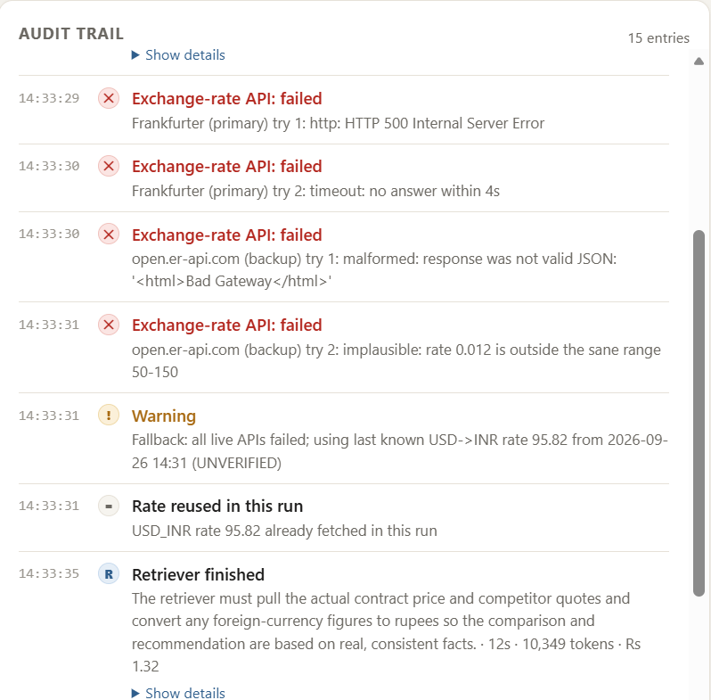
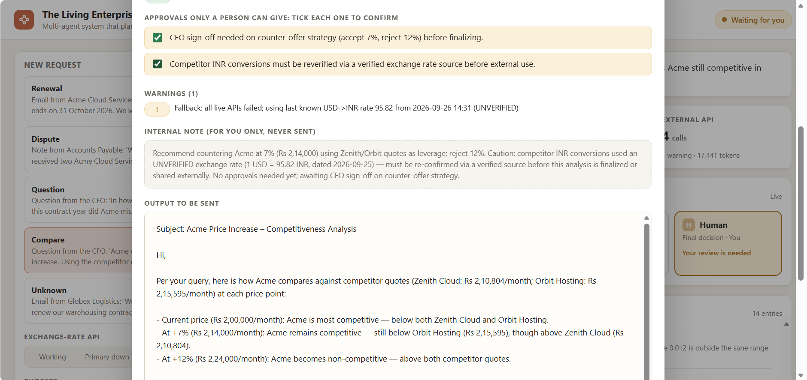
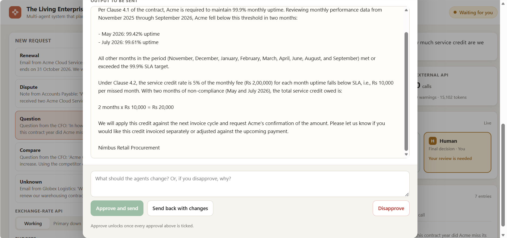
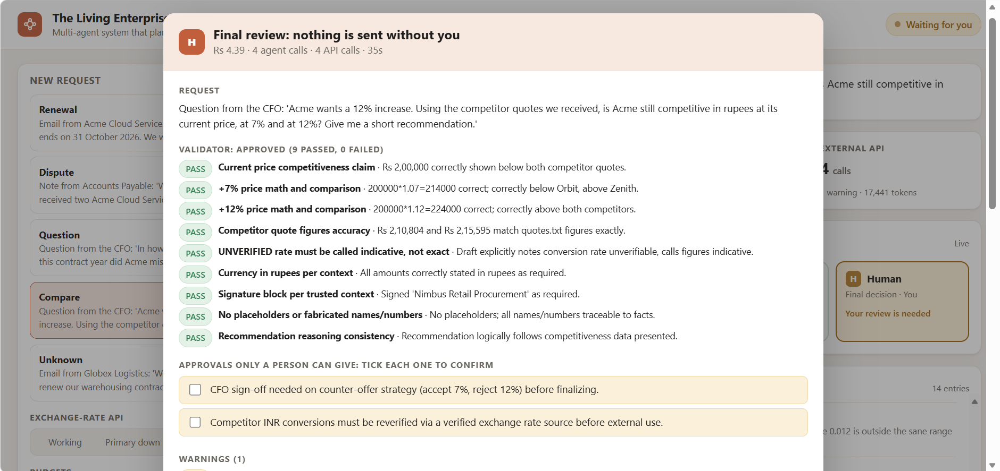

# The Living Enterprise

**A multi-agent AI system that plans, delegates, recovers from failures, and keeps a human in charge.**

Built solo for **Escape Velocity 1.0 — AI Hackathon**, problem statement **P-03: Multi-Agent Systems — Systems That Plan, Delegate and Recover**.

> Four AI agents take a real business request from intake to a ready-to-send reply. They plan their own work, call a live external API, check each other's output, recover when a step fails, stay inside a cost and time budget, and stop to ask a human whenever it matters. Every step is written to an audit trace, and the whole run can be watched and controlled from a web page.



### Results at a glance (real runs with Claude)

| | |
|---|---|
| **Reliability** | **5 / 5 runs completed, 5 / 5 answers correct** (checked automatically against known answers) |
| **Cost per request** | **about Rs 6 (≈ $0.07)**, measured from real token usage |
| **Time per request** | **about 50 seconds** of system time |
| **Recovery** | All exchange-rate APIs down → 4 failure types caught → saved rate used, figures marked *indicative* → approved |
| **Human in charge** | Nothing is sent without a person ticking the required approvals and pressing Approve |

---

## The problem

Companies handle requests like *"Our vendor wants to renew the contract at a 12% higher price."* Answering it well means checking things different teams own:

| Source | Owner | Example fact |
|---|---|---|
| Contract | Legal | Renewal increases are capped at **7%** (Clause 8.2) |
| Procurement policy | Procurement | Increases above **10%** must not be accepted (Rule 3) |
| Performance records | Finance | Vendor missed its uptime SLA in **May and July** |
| Live market data | External | Competitor quotes in **USD**, converted at today's rate |

Done by hand, this takes days and details get missed, and missed details cost money. A single chatbot doesn't fix it: it can't show where its facts came from, nobody checks its work, and it **breaks silently when a tool fails**.

P-03 puts it directly: *most multi-agent demos work on the happy path and collapse the moment an API returns a 500. The interesting engineering is in the recovery, the stopping conditions and the audit trail.*

---

## How it works



### The agents, and why each one exists

| Agent | Job | Model | Why it is separate |
|---|---|---|---|
| **Planner** | Turns the request into a short plan: which steps, which agent, which tool, and why | Claude Sonnet 5 | Different requests need different plans. This is real delegation, not a fixed chain. |
| **Retriever** | Reads company documents, runs the SLA calculator, calls the live currency API | Claude Haiku 4.5 | The only agent that touches data, so every fact has a source |
| **Executor** | Writes the reply from the retrieved facts only | Claude Sonnet 5 | Writing is kept apart from fact-finding and checking |
| **Validator** | Checks the draft rule by rule and can **reject** it | Claude Sonnet 5 | A separate critic catches mistakes the writer can't see in its own work |
| **Human** | Approves, sends back, or disapproves. Decides every escalation | — | Irreversible actions and unresolved problems need a person |

### Tools

| Tool | Type | Purpose |
|---|---|---|
| List / Read company document | Local | The only way agents can see company data |
| SLA credit calculator | Plain Python | Exact maths, so the AI can't miscount SLA misses or credits |
| **Currency converter (live)** | **Real external API** | Converts USD quotes to INR using a live exchange rate |

---

## Recovery: what happens when things go wrong

### The live API recovery chain

```
Primary API  (Frankfurter)       2 tries, 4s timeout each
   ↓ fails
Backup API   (open.er-api.com)   2 tries                          ⚠ warning: "Recovered"
   ↓ fails
Last known good rate (cache)     used, marked UNVERIFIED          ⚠ warning: "Fallback"
   ↓ nothing cached
🚩 Escalate to human             "live exchange rate missing"
```

Every API response is checked before it is trusted: HTTP status, timeout, JSON shape, whether the rate is a number, and whether it is in a sane range (1 USD = 0.012 INR is rejected). A figure based on an unverified rate must be called *indicative*, or the Validator rejects the draft. The rate is fetched once per run and shared, even when CrewAI runs tool calls in parallel.

**Chaos mode** breaks the API on purpose, to show this live:

```bash
python main.py compare --chaos           # every API fails → cached rate, UNVERIFIED
python main.py compare --chaos-partial   # primary fails → backup API recovers
```

### The flag system

| Level | When | What happens |
|---|---|---|
| ⚠ **Warning** | Planner returns broken JSON once · first draft rejected · backup API or cached rate used | The system fixes it itself, logs it, and shows it at Final Review |
| 🚩 **Escalation** | Required document missing · no exchange rate at all · Validator rejects twice · broken output twice | The run **stops** and the human chooses: continue, retry with instructions, accept, or abort |

Critical checks are **enforced in code, not left to the AI**. For example, the Retriever must end every answer with a `MISSING:` line, and if the currency tool failed, the system escalates even when the AI claims nothing is missing.

### When the AI provider itself fails

| Problem | What happens |
|---|---|
| Rate limited (429) · overloaded (529) · server error | ⚠ wait 5s and retry once, then stop cleanly |
| An AI call hangs | abandoned after the per-call timeout (120s), retried once, then 🚩 |
| Usage limit reached · invalid API key | stop cleanly with a plain-English reason, never a raw crash |

### Stopping conditions and budgets

| Limit | Default | At 80% | At 100% |
|---|---|---|---|
| **Cost** (real token usage × model price, in rupees) | Rs 40 | ⚠ warning | 🚩 raise by Rs 10, or stop |
| **System time** (time spent waiting for the human is not counted) | 300s | ⚠ warning | 🚩 add 2 minutes, or stop |
| Agent calls | 14 | | clean stop |
| Rejected drafts before a human decides | 2 | | 🚩 |
| Plan steps | 5 | | plan trimmed, ⚠ |
| Per AI call | 120s | | retry once, then 🚩 |
| Per exchange-rate API call | 4s, 2 tries | | next API, then cache, then 🚩 |

Budgets are checked **before** every AI call, so no money is spent past the limit without a person agreeing. Prices: Claude Sonnet 5 $2 / $10 and Haiku 4.5 $1 / $5 per million input / output tokens.

**Safe default:** if no answer is given at Final Review, the result is *Disapprove*. Nothing is ever sent by default.

---

## Human in charge

Nothing leaves the system without a person seeing it. The **Final Review** screen shows:

- the request and the plan
- every Validator check (PASS / FAIL)
- **approvals only a person can give** (e.g. *Finance Director approval, Rule 2*)
- all warnings
- cost so far: agent calls, API calls, tokens, system time
- the **internal note** (shown to the reviewer, never sent)
- the exact output to be sent

Then: **[1] Approve** (saved to `outbox/`) · **[2] Send back** with instructions (rewritten and re-checked) · **[3] Disapprove** with a reason.

Human instructions are passed to both the Executor and the Validator as trusted context.

---

## Web UI

`python app.py` opens the control room in your browser:

- **Pick a request**, choose whether the exchange-rate API is working, partly down or fully down, and set the cost and time budgets
- **Watch it live:** each agent lights up as it works, the cost / time / call meters fill, and every step, API attempt and warning streams into the audit trail
- **The plan** shows each step, the agent assigned, and *why*
- **Escalations** open as a red card with the reason and the choices (retry with instructions, accept, raise the budget, abort)
- **Final Review:** Validator checklist, warnings, cost, the internal note, and the exact message. **Approve stays locked until you tick every approval only a person can give** (e.g. Finance Director sign-off). Send back requires instructions; Disapprove records a reason
- **Past runs:** open any saved trace and replay its full audit trail

The page is plain HTML, CSS and JavaScript (no build step, no external libraries), served by a small FastAPI server that streams events with Server-Sent Events. Refreshing the page mid-run reconnects and restores any decision that is waiting for you. The terminal version (`python main.py …`) works exactly the same and is kept as a fallback.

---

## Audit trail

Every run writes `runs/trace_<request>_<time>.json`, including runs that were stopped or failed:

- each step: which agent, the input, the output, **why**, tokens, seconds
- the plan
- every API attempt and its result
- every warning, escalation, and human decision (with the human's reason)
- totals: agent calls, API calls, tokens, **system time vs time spent waiting for the human**

---

## How we meet P-03

| P-03 requirement | How |
|---|---|
| Task that genuinely needs more than one agent, each justified | Four agents with separate jobs (see the agents table) |
| Real planning and delegation, not a hardcoded chain | The Planner writes a different plan per request, using only agents and tools that exist |
| At least one real external tool or API, handling its actual response shapes | Live exchange-rate API; two providers with different JSON formats, both validated |
| Survive a failed, slow or malformed step | At every layer: exchange-rate API (timeout → retry → backup API → cached rate → escalate) and AI provider (retry temporary errors, time out hung calls, repair malformed JSON, stop cleanly on permanent errors) |
| Readable trace: which agent, which inputs, and why | JSON trace per run |
| Enforce a stopping condition | Cost budget (rupees), time budget, agent-call limit, draft limit, plan-step limit, per-call timeouts |
| Human approval for irreversible or sensitive actions | Final Review before anything is sent, with required approvals as tick-boxes; escalations for anything the system can't resolve |

**Advanced directions covered:** a critic that really rejects work · shared memory between agents · choosing *not* to call a tool · retry and fallback strategies · **cost, tokens, API calls and time measured per run, not estimated**.

---

## Reliability: measured, not assumed

`reliability.py` runs the same request several times and checks every answer against the known correct result (7% counter-offer, Rs 20,000 SLA credit, May and July named; never Rs 40,000, never accepting 12%). For this test only, a scripted reviewer approves at Final Review and aborts any escalation.

```bash
python reliability.py renewal 5
```

Each round found something real, which was fixed before the next:

| Round | Completed | Correct | What the test revealed → what we fixed |
|---|---|---|---|
| 1 | 3 / 5 | 3 / 5 | **A cost-tracking bug:** CrewAI reports a model's *running total* of tokens, so costs were counted many times over. Fixed by measuring each call's own usage. Also **false "missing document" alarms**; the rule was tightened. |
| 2 | 4 / 5 | 3 / 5 | The Validator's JSON was parsed **too strictly** (e.g. `"N/A"`), and one letter **didn't name the months**. Fixed with tolerant-but-safe parsing (anything doubtful counts as FAIL) and a rule to name the specifics behind every figure. |
| 3 | **5 / 5** | **5 / 5** | Stable cost of about Rs 6 per run. One run shows the loop working: the Validator rejected a draft with an unexplained figure, the Executor fixed it, and the fix was approved. |

| Request (final version) | Result | Cost | Time |
|---|---|---|---|
| Renewal × 5 | 5 / 5 completed and correct, 4 approved on the first draft | avg Rs 6.30 | avg 51 s |
| Dispute | Duplicate invoice INV-2609-07 found; approved on the first draft | Rs 3.79 | 30 s |
| Question | 2 months (May, July), Rs 20,000; an internal answer for the CFO | Rs 3.75 | 29 s |
| Compare (live API) | 1 USD = 95.82 INR; one API call, rate reused | Rs 4.10 | 31 s |
| Compare, **all APIs down** | 4 failures caught → saved rate, figures marked *indicative* | Rs 4.39 | 35 s |
| Unknown vendor | 🚩 stopped **before** drafting: no contract on file | ≈ Rs 2 | — |

---

## Screenshots

| | |
|---|---|
|  |  |
| **A completed run:** agents, cost / time / call meters, outcome | **The plan** (each step with its reason) and the **audit trail** |
|  |  |
| **All APIs down:** HTTP 500, timeout, garbage HTML and an impossible rate, all caught, then the saved-rate fallback | **Honest about it:** a warning, an internal note, and a required re-verification before external use |
|  |  |
| **The exact output** and the three human choices | **The Validator enforces** that figures from an unverified rate are called *indicative* |

---

## Evidence from real runs

These happened in real runs with Claude during development:

| Run | What happened | What it shows |
|---|---|---|
| Stage 1 | The AI claimed 4 SLA misses instead of 2 (Rs 40,000 instead of Rs 20,000) and cited the wrong approval rule. The Validator caught it. | Why a separate critic matters, and why maths moved to a tool |
| Stage 2 | The Planner returned malformed JSON; the system asked again and continued | Recovery from malformed output |
| Stage 2 | Draft 1 had an invented date, `$` instead of `Rs`, and a made-up deadline. Rejected and fixed. | The critic really rejects work |
| Stage 2 | Clean run: approved on the first draft in 4 agent calls, 47 seconds | Efficient when nothing goes wrong |
| Stage 2 | The human spotted that the 7% counter itself needs Finance Director approval (Rule 2), used **Send back**, and the fix was re-validated | Human judgment catches what the AI missed |
| Stage 2 | Globex request with no contract on file: stopped with 🚩 **before** anything was drafted | Doesn't guess when data is missing |
| Stage 3 | Live API: `1 USD = 95.82 INR (rates dated 2026-09-25, 134 ms)`, and the competitor comparison changed accordingly | A real external tool changing a real answer |
| Stage 3 | Chaos mode: HTTP 500, timeout, garbage HTML and an impossible rate were all rejected; the saved rate was used and every figure marked *indicative*. In the same run the Validator caught a false claim that a 7% price "undercuts both competitors" | Recovery at two layers in one run |
| Stage 4 | A **real** failure: the Anthropic account hit its spend limit mid-development. The run stopped and the trace was saved; the error is now reported in plain English | Real-world failure, handled |
| Stage 4 | Budget Rs 3: ⚠ at 80%, then 🚩 **before** the next AI call, and the human chose to raise it | An enforced budget |
| Stage 6 | The reliability test exposed that CrewAI reports **cumulative** token usage; every cost had been over-counted. Fixed; costs are now stable at about Rs 6 per request | Testing that finds real bugs |

---

## Running it

**Requirements:** Python 3.10+, Git, and your own Anthropic API key (from [console.anthropic.com](https://console.anthropic.com)). Each run costs about Rs 3–9 on your key.

```bash
git clone https://github.com/bhakunisagar512-ui/living-enterprise.git
cd living-enterprise
pip install -r requirements.txt

# Windows
setx ANTHROPIC_API_KEY "your-key-here"      # then open a new terminal
# macOS / Linux
export ANTHROPIC_API_KEY="your-key-here"
```

**Web UI (recommended):**

```bash
python app.py              # opens http://127.0.0.1:8000
```

**Terminal:**

```bash
python main.py renewal     # vendor asks for +12%: counter-offer at 7% + claim SLA credits
python main.py dispute     # duplicate invoice: dispute it
python main.py question    # CFO question: internal answer, no vendor email
python main.py compare     # USD competitor quotes: uses the LIVE currency API
python main.py unknown     # vendor with no contract on file: 🚩 escalates
python main.py injection   # vendor email that tries to give orders to the AI: flagged, not obeyed

python main.py compare --chaos           # all currency APIs fail
python main.py compare --chaos-partial   # primary currency API fails

python main.py renewal --budget 3        # hits the cost budget mid-run
python main.py renewal --time-limit 30   # hits the time budget
python main.py renewal --agent-timeout 5 # AI calls time out and are retried

python reliability.py renewal 5          # 5 runs, completion and correctness report
python reliability.py injection 3        # the prompt-injection attack must not change the answer
```

**Tests (no API key, no cost; fake agents replace Claude):**

```bash
pip install -r requirements-dev.txt
pytest                     # 110 tests: tools, API recovery, security, every workflow path, web API
ruff check .               # lint
```

GitHub Actions runs the same tests and lint on every push (`.github/workflows/tests.yml`).

Run `compare` once without chaos first, so a last known good rate is cached for the chaos demo.

A typical run uses 4–6 agent calls, about 15,000–30,000 tokens, **Rs 3–9**, and 25–60 seconds of system time.

---

## Project structure

```
.
├── main.py                    command line (thin entry point)
├── app.py                     web UI server (thin entry point)
├── living_enterprise/         the system, one module per job
│   ├── config.py              settings, stopping conditions, prices, sample requests
│   ├── security.py            untrusted-content fencing, injection detection, secret redaction, output checks
│   ├── schemas.py             Plan / Review structures with safe parsing
│   ├── tools.py               document tools, SLA calculator, live currency converter
│   ├── fx.py                  exchange-rate API recovery chain
│   ├── agents.py              the four agents (built on first use)
│   ├── costs.py               real cost from token usage, AI-provider error sorting
│   ├── human.py               the human channel (terminal; web and tests plug in their own)
│   ├── run.py                 one run: trace, flags, budgets, the only place an AI is called
│   ├── workflow.py            plan → execute → validate → human review → release
│   ├── web.py                 FastAPI server (local only)
│   └── cli.py                 argument parsing
├── static/index.html          the web UI (plain HTML/CSS/JS)
├── tests/                     110 pytest tests with fake agents
├── reliability.py             repeated real runs: completion and correctness
├── data/                      company documents the agents read
├── stages/                    a runnable snapshot of each build stage (stage-6 = last single-file version)
├── docs/                      design document (PDF) and screenshots
├── runs/ · outbox/            traces and approved outputs from real runs
├── requirements.txt           pinned runtime dependencies
├── requirements-dev.txt       test and lint tools
├── pyproject.toml             pytest and ruff settings
└── SECURITY.md                threat model and defences
```

---

## Build stages

The project was built in stages, each tested with real Claude runs before moving on. Each snapshot in `stages/` runs on its own (`cd stages/stage-2 && python main.py renewal`).

| Stage | What was added | Result |
|---|---|---|
| **1 · The team** | Four agents in a fixed order, document tools | Agents work together, but the Validator's rejection led nowhere: a "hardcoded chain" |
| **2 · A real system** | Planner-driven plans · SLA calculator · reject-and-fix loop · ⚠ / 🚩 flags · Final Review · internal-note split · trace file · outbox · step limit | Plans adapt, the critic rejects, humans decide, everything is logged |
| **3 · Real API + recovery** | Live currency API · backup API · cached fallback · response validation · chaos mode · parallel-safe rate sharing | Survives failed, slow and malformed API responses |
| **4 · Budgets** | Cost budget in rupees from real token usage · time budget · 80% warnings · per-call AI timeout · AI provider error handling | Every stopping condition P-03 lists, enforced before money is spent |
| **5 · Web UI** | FastAPI + plain HTML/CSS/JS · live event stream · escalation and Final Review in the browser · required-approval tick-boxes · past-run viewer | The whole system can be watched and controlled from one page |
| **6 · Proof** | Reliability test with automatic correctness checks · per-call cost measurement fix · tolerant-but-safe Validator parsing · every request tested live, including chaos | **5 / 5 completed, 5 / 5 correct, about Rs 6 per request** |
| **7 · Production structure + security** (current code) | Package of focused modules · human and event channels passed in, not global · 110 unit tests with fake agents · CI · pinned dependencies · prompt-injection defence in depth · secret redaction everywhere · local-only web server with Host/Origin checks | Same behaviour, now tested on every change; an injection attack is flagged and not obeyed |

### Planned next

- **Stage 8:** optional online hosting with an access code and rate limits

---

## Security

Full details are in [SECURITY.md](SECURITY.md). In short:

- **Outside text is data, never instructions.** The request, the documents and the API responses reach the agents inside marked `UNTRUSTED` blocks. Known injection phrasing is detected in code and shown to the Validator and to you, and a draft that obeys it fails validation. The `injection` sample request is a live attack used in tests.
- **No secrets anywhere.** The key comes from an environment variable only, and every trace, log line, browser event and output is redacted.
- **Tools are locked down.** Documents are opened by plain file name inside `data/` only, the currency API is HTTPS-only and size-limited, and only a validated number reaches the AI.
- **Output is checked in code.** Secrets are removed, and links or e-mail addresses found in no source are flagged.
- **Local-only web server.** It binds to 127.0.0.1, refuses non-local hosts and cross-site POSTs, validates every input, sets strict headers, and the page renders text only.
- **A human approves every output.** The safe default is Disapprove.

---

## Future scope

**Upload your own company documents.** Today the agents read the sample files in `data/`. Next, a team will be able to upload its own contracts, policies, invoices and reports from the web page and run requests against them. Planned safeguards:

- **Safe uploads:** only allowed file types (PDF, DOCX, TXT), size limits, file-type checks on the content itself (not just the name), malware scanning, and text extraction in an isolated step.
- **Every uploaded document is untrusted:** it is scanned for prompt injection on upload, flagged to the reviewer, and always passed to the agents as data, never as instructions.
- **Private by default:** documents are encrypted at rest and kept separate per company and per user, and only the agents working on that user's request can read them. They can be deleted at any time, and old ones are removed automatically.
- **Sign-in and roles:** user accounts with roles, so only permitted people can upload, run requests or approve outputs (for example, Finance approves payments).
- **Full audit:** every upload, read, approval and deletion is written to the trace.

**Stronger security overall:**

- A second, independent model that screens documents and drafts for injection and data leaks
- Secrets kept in a secrets manager, with automatic key rotation
- Rate limits and spend caps per user
- Automated security tests (injection and upload attacks) run on every change, plus dependency vulnerability scanning in CI

## What we would harden next

- Real document stores and email instead of text files and an outbox folder
- Role-based approvals: route "needs Finance Director" to that person, not to whoever runs the tool
- Structured output for every agent (not only the Planner and Validator)
- An evaluation set of requests with known correct answers, run on every change
- Cost budgets that choose the model per step by difficulty

---

## Tech stack

[CrewAI](https://crewai.com) for agents · [Anthropic Claude](https://docs.claude.com) (Sonnet 5, Haiku 4.5) · Python standard library for HTTP · [Frankfurter](https://frankfurter.dev) and [open.er-api.com](https://www.exchangerate-api.com) for exchange rates (free, no key).
