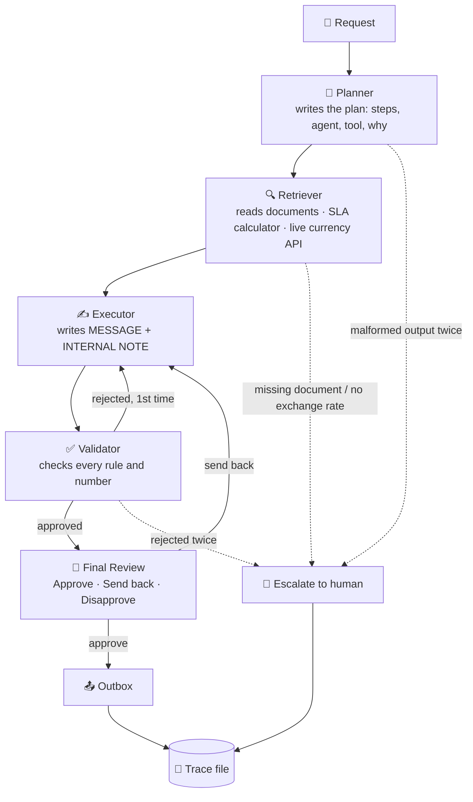

# The Living Enterprise

**A multi-agent AI system that plans, delegates, recovers from failures, and keeps a human in charge.**

Built solo for **Escape Velocity 1.0 — AI Hackathon**, problem statement **P-03: Multi-Agent Systems — Systems That Plan, Delegate and Recover**.

> Four AI agents take a real business request from intake to a ready-to-send reply. They plan their own work, call a live external API, check each other's output, recover when a step fails, and stop to ask a human whenever it matters. Every step is written to an audit trace.

---

## The problem

Companies handle requests like *"Our vendor wants to renew the contract at a 12% higher price."* Answering it well means checking things different teams own:

| Source | Owner | Example fact |
|---|---|---|
| Contract | Legal | Renewal increases are capped at **7%** (Clause 8.2) |
| Procurement policy | Procurement | Increases above **10%** must not be accepted (Rule 3) |
| Performance records | Finance | Vendor missed its uptime SLA in **May and July** |
| Live market data | External | Competitor quotes in **USD**, converted at today's rate |

Done by hand, this takes days and details get missed, and missed details cost money. A single chatbot doesn't fix it: it can't show where its facts came from, nobody checks its work, and it **breaks silently when a tool fails**.

P-03 puts it directly: *most multi-agent demos work on the happy path and collapse the moment an API returns a 500. The interesting engineering is in the recovery, the stopping conditions and the audit trail.*

---

## How it works



### The agents, and why each one exists

| Agent | Job | Model | Why it is separate |
|---|---|---|---|
| **Planner** | Turns the request into a short plan: which steps, which agent, which tool, and why | Claude Sonnet 5 | Different requests need different plans. This is real delegation, not a fixed chain. |
| **Retriever** | Reads company documents, runs the SLA calculator, calls the live currency API | Claude Haiku 4.5 | The only agent that touches data, so every fact has a source |
| **Executor** | Writes the reply from the retrieved facts only | Claude Sonnet 5 | Writing is kept apart from fact-finding and checking |
| **Validator** | Checks the draft rule by rule and can **reject** it | Claude Sonnet 5 | A separate critic catches mistakes the writer can't see in its own work |
| **Human** | Approves, sends back, or disapproves. Decides every escalation | — | Irreversible actions and unresolved problems need a person |

### Tools

| Tool | Type | Purpose |
|---|---|---|
| List / Read company document | Local | The only way agents can see company data |
| SLA credit calculator | Plain Python | Exact maths, so the AI can't miscount SLA misses or credits |
| **Currency converter (live)** | **Real external API** | Converts USD quotes to INR using a live exchange rate |

---

## Recovery: what happens when things go wrong

### The live API recovery chain

```
Primary API  (Frankfurter)       2 tries, 4s timeout each
   ↓ fails
Backup API   (open.er-api.com)   2 tries                          ⚠ warning: "Recovered"
   ↓ fails
Last known good rate (cache)     used, marked UNVERIFIED          ⚠ warning: "Fallback"
   ↓ nothing cached
🚩 Escalate to human             "live exchange rate missing"
```

Every API response is checked before it is trusted: HTTP status, timeout, JSON shape, whether the rate is a number, and whether it is in a sane range (1 USD = 0.012 INR is rejected). A figure based on an unverified rate must be called *indicative*, or the Validator rejects the draft. The rate is fetched once per run and shared, even when CrewAI runs tool calls in parallel.

**Chaos mode** breaks the API on purpose, to show this live:

```bash
python main.py compare --chaos           # every API fails → cached rate, UNVERIFIED
python main.py compare --chaos-partial   # primary fails → backup API recovers
```

### The flag system

| Level | When | What happens |
|---|---|---|
| ⚠ **Warning** | Planner returns broken JSON once · first draft rejected · backup API or cached rate used | The system fixes it itself, logs it, and shows it at Final Review |
| 🚩 **Escalation** | Required document missing · no exchange rate at all · Validator rejects twice · broken output twice | The run **stops** and the human chooses: continue, retry with instructions, accept, or abort |

Critical checks are **enforced in code, not left to the AI**. For example, the Retriever must end every answer with a `MISSING:` line, and if the currency tool failed, the system escalates even when the AI claims nothing is missing.

### Stopping conditions

- At most **14 agent calls** per run, then a clean stop
- At most **2 drafts** rejected before a human decides
- At most **5 plan steps**
- **4-second timeout** and **2 tries** per API
- **Safe default:** if no answer is given at Final Review, the result is *Disapprove*. Nothing is ever sent by default.

---

## Human in charge

Nothing leaves the system without a person seeing it. The **Final Review** screen shows:

- the request and the plan
- every Validator check (PASS / FAIL)
- **approvals only a person can give** (e.g. *Finance Director approval, Rule 2*)
- all warnings
- cost so far: agent calls, API calls, tokens, system time
- the **internal note** (shown to the reviewer, never sent)
- the exact output to be sent

Then: **[1] Approve** (saved to `outbox/`) · **[2] Send back** with instructions (rewritten and re-checked) · **[3] Disapprove** with a reason.

Human instructions are passed to both the Executor and the Validator as trusted context.

---

## Audit trail

Every run writes `runs/trace_<request>_<time>.json`, including runs that were stopped or failed:

- each step: which agent, the input, the output, **why**, tokens, seconds
- the plan
- every API attempt and its result
- every warning, escalation, and human decision (with the human's reason)
- totals: agent calls, API calls, tokens, **system time vs time spent waiting for the human**

---

## How we meet P-03

| P-03 requirement | How |
|---|---|
| Task that genuinely needs more than one agent, each justified | Four agents with separate jobs (see the agents table) |
| Real planning and delegation, not a hardcoded chain | The Planner writes a different plan per request, using only agents and tools that exist |
| At least one real external tool or API, handling its actual response shapes | Live exchange-rate API; two providers with different JSON formats, both validated |
| Survive a failed, slow or malformed step | Timeout → retry → backup API → cached rate → escalate. Malformed agent output is retried too |
| Readable trace: which agent, which inputs, and why | JSON trace per run |
| Enforce a stopping condition | Agent-call limit, draft limit, plan-step limit, API timeout |
| Human approval for irreversible or sensitive actions | Final Review before anything is sent; escalations for anything the system can't resolve |

**Advanced directions covered:** a critic that really rejects work · shared memory between agents · choosing *not* to call a tool (no API call when everything is already in rupees) · retry and fallback strategies · tokens, API calls and time measured per run.

---

## Evidence from real runs

These happened in real runs with Claude during development:

| Run | What happened | What it shows |
|---|---|---|
| Stage 1 | The AI claimed 4 SLA misses instead of 2 (Rs 40,000 instead of Rs 20,000) and cited the wrong approval rule. The Validator caught it. | Why a separate critic matters, and why maths moved to a tool |
| Stage 2 | The Planner returned malformed JSON; the system asked again and continued | Recovery from malformed output |
| Stage 2 | Draft 1 had an invented date, `$` instead of `Rs`, and a made-up deadline. Rejected and fixed. | The critic really rejects work |
| Stage 2 | Clean run: approved on the first draft in 4 agent calls, 47 seconds | Efficient when nothing goes wrong |
| Stage 2 | The human spotted that the 7% counter itself needs Finance Director approval (Rule 2), used **Send back**, and the fix was re-validated | Human judgment catches what the AI missed |
| Stage 2 | Globex request with no contract on file: stopped with 🚩 **before** anything was drafted | Doesn't guess when data is missing |
| Stage 3 | Live API: `1 USD = 95.82 INR (rates dated 2026-09-25, 134 ms)`, and the competitor comparison changed accordingly | A real external tool changing a real answer |

---

## Running it

**Requirements:** Python 3.10+ and an Anthropic API key.

```bash
pip install -r requirements.txt

# Windows
setx ANTHROPIC_API_KEY "sk-ant-..."      # then open a new terminal
# macOS / Linux
export ANTHROPIC_API_KEY="sk-ant-..."
```

```bash
python main.py renewal     # vendor asks for +12%: counter-offer at 7% + claim SLA credits
python main.py dispute     # duplicate invoice: dispute it
python main.py question    # CFO question: internal answer, no vendor email
python main.py compare     # USD competitor quotes: uses the LIVE currency API
python main.py unknown     # vendor with no contract on file: 🚩 escalates

python main.py compare --chaos           # all currency APIs fail
python main.py compare --chaos-partial   # primary currency API fails
```

Run `compare` once without chaos first, so a last known good rate is cached for the chaos demo.

A typical run uses 4–7 agent calls, about 20,000–55,000 tokens, and 30–90 seconds of system time.

---

## Project structure

```
.
├── main.py                  the system (latest stage)
├── data/                    company documents the agents read
│   ├── contract.txt         Acme master services agreement
│   ├── policy.txt           procurement policy (Rules 1-5)
│   ├── spend.txt            spend and monthly uptime
│   ├── invoices.txt         invoices, including a duplicate
│   └── quotes.txt           competitor quotes in USD
├── stages/                  a runnable snapshot of each build stage
│   ├── stage-1/
│   ├── stage-2/
│   └── stage-3/
├── docs/                    design document (PDF)
├── runs/                    trace files (created when you run it)
├── outbox/                  approved outputs (created when you run it)
└── requirements.txt
```

---

## Build stages

The project was built in stages, each tested with real Claude runs before moving on. Each snapshot in `stages/` runs on its own (`cd stages/stage-2 && python main.py renewal`).

| Stage | What was added | Result |
|---|---|---|
| **1 · The team** | Four agents in a fixed order, document tools | Agents work together, but the Validator's rejection led nowhere: a "hardcoded chain" |
| **2 · A real system** | Planner-driven plans · SLA calculator · reject-and-fix loop · ⚠ / 🚩 flags · Final Review · internal-note split · trace file · outbox · step limit | Plans adapt, the critic rejects, humans decide, everything is logged |
| **3 · Real API + recovery** | Live currency API · backup API · cached fallback · response validation · chaos mode · parallel-safe rate sharing | Survives failed, slow and malformed API responses |

### Planned next

- **Stage 4:** time and cost budgets per run (in rupees), alongside the step limit
- **Stage 5:** a readable HTML trace report
- **Stage 6:** a 5-run reliability test (completion rate), demo script, pitch

---

## What we would harden next

- Real document stores and email instead of text files and an outbox folder
- Role-based approvals: route "needs Finance Director" to that person, not to whoever runs the tool
- Structured output for every agent (not only the Planner and Validator)
- An evaluation set of requests with known correct answers, run on every change
- Cost budgets that choose the model per step by difficulty

---

## Tech stack

[CrewAI](https://crewai.com) for agents · [Anthropic Claude](https://docs.claude.com) (Sonnet 5, Haiku 4.5) · Python standard library for HTTP · [Frankfurter](https://frankfurter.dev) and [open.er-api.com](https://www.exchangerate-api.com) for exchange rates (free, no key).
